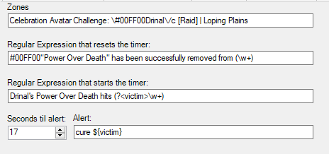
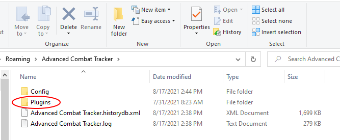

# Drinal Avatar Curse ACT Plugin
This plugin helps healers cure the *Power Over Death* curse that the Drinal avatar casts on raiders.

The mechanic of the curse is that when cured, Drinal recasts it on a player about one second later. So if it is immediately cured, the raid will quickly run out of curse cures.

The mechanic of the cure is that the curse needs to sit on a player for a while before it is cured, to allow the cooldown time on healer curse cures to expire.

This plugin starts a timer when the curse lands on a player. At the expiration of the timer, the plugin generates an audio alert that says *cure name*, where *name* is the player to cure.

The plugin also watches for the curse to be cured to prepare for the next curse to land.

The sequence of events is:
1. Curse lands on Player1
1. Plugin timer starts.
1. Plugin timer expires.
1. Plugin announces "cure Player1"
1. Healer cures Player1
1. Drinal casts the curse on Player2
1. Plugin timer starts.
1. Repeat from Step 3.

The default values for the curse landing, being cured, alert time, and alert text are set for the Drinal avatar and shown below. The "let the curse sit" time defaults to 17 seconds. This (barely) allows three healers to cover the curses with a little bit of margin for error. Four healers is safer.

# Installation

If you already have a version installed and enabled, the following sections are not relevant. You will get a prompt to update to the latest version when you run ACT.

Otherwise, the plugin must be manually downloaded and installed. 
The steps you will be taking are:
* Download the `Drinal.dll` file from the Releases page. 
  * You will need to leave this instructions page to do so.
* Install the downloaded file in ACT. 
  * Install instructions are on this page. Come back to this page after the download if you need to. 

Details are provided below. 

## Download

1. You might want to first read through all the steps since you will be leaving this page.
2. To go to the download page, click the following link: [Releases Page](https://github.com/jeffjl74/ACT_Drinal/releases)
3. On the "Releases" page, for the __Latest release__, click the "Assets 3" title to expand the assets (if needed). 
The page with the expanded view will list three files.
4. Click the `Drinal.dll` link, download and save the file. 
	* Pay attention to where the file was downloaded. 
It will typically be in your "Downloads" folder.
In the Chrome browser, you can select _Show in folder_ after the download to open the folder in File Explorer.

## Add the plugin to ACT
### Move the downloaded file (optional)
The `Drinal.dll` file may be used right where you downloaded it, or use the following steps to put it in
the folder in which ACT normally saves plugins.

1. In Windows, open a File Explorer and browse to wherever you saved the `Drinal.dll` file, 
(typically the _Downloads_ folder) 
select it and choose either _Copy_ or _Cut_.
2. ACT's preferred folder is accessed from the _App Data Folder_ link in the About tab in ACT. Click that link, shown below:

3. Then double-click the _Plugins_ folder in File Explorer

4. Paste the `Drinal.dll` file in the _Plugins_ folder.

### Add/Enable the plugin in ACT
1. In ACT, click the "Plugins" tab and its "Plugin Listing" tab. 

2. Click the [Browse...] button and navigate to where you saved `Drinal.dll`
   * If you moved `Drinal.dll` to the _Plugins_ folder, you can get there by entering 
   `%appdata%\Advanced Combat Tracker\Plugins` 
   in the File Explorer navigation bar as shown below 

3. Select the `Drinal.dll` file and press [Open]. 
Then press the [Add/Enable Plugin] button. 

You should now have a `Drinal.dll` tab in your plugins tabs. Click on the tab to see the settings. 
